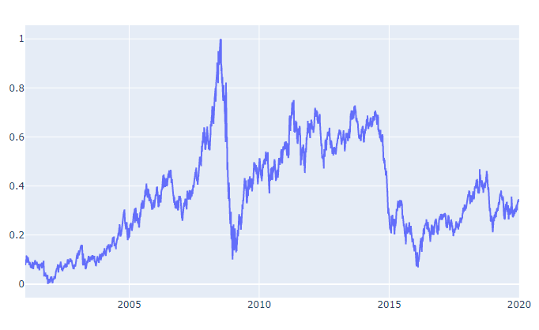
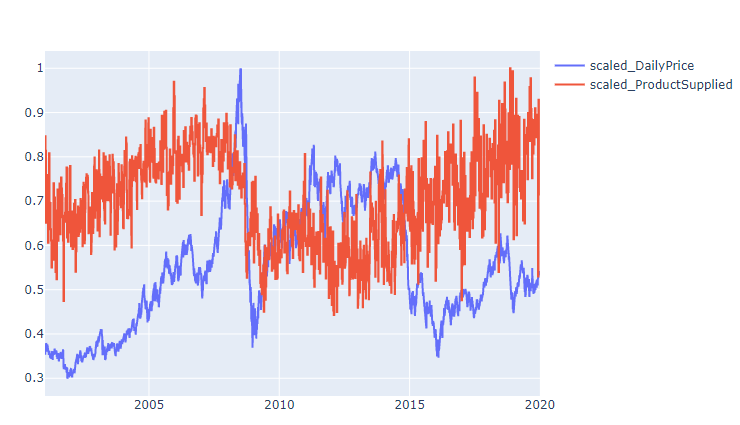
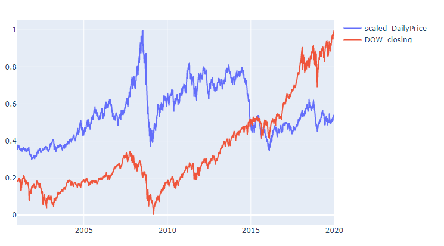
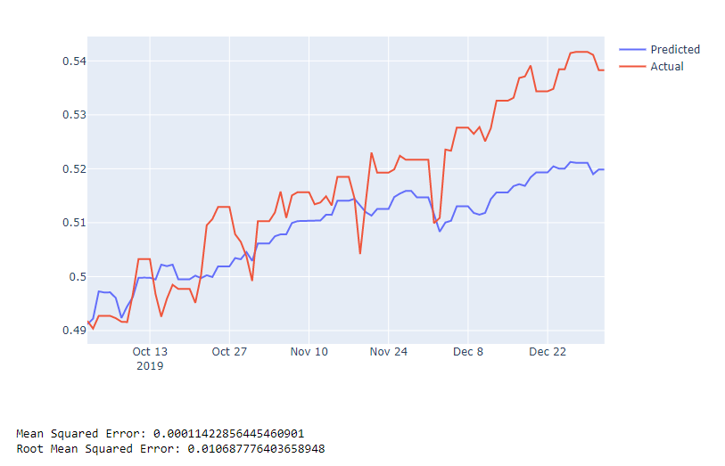

# __Introduction__
 
The purpose of this project twofold: 

1. to develop a model that can accurately predict movements in the spot price of crude oil and serve a live updating web based dashboard displaying the latest price, supply and demand data as well as the latest crude oil related news. 

The dashboard is live and can be accessed at texasanalytics.org.

2. To create a model to predict movements in oil prices. 

### __<ins> NOTE: The data used in this project is not present in the repo and must be downloaded seperately.__

- Please see "Data Sources" section below
 
# __Repository structure__
 
This Repository consists of the following files and directories:
 
1. __<ins>assets/:__

    Contains CSS and image files used by the Dash app. 
 
2. __<ins>datashop/:__
      
    Datashop is the name of a pypi package I maintain where I keep handy functions and classes. I have kept these particular classes within this repository to make it easier to inspect them. 

3. __<ins>__init__.py:__

    This is the main application module that contains the dash application. 
 
4. __<ins>application_components:__
 
    Contains some components for the Dash application. I seperated these out to make the code more manageable.  
 
5. __<ins>CrudeOilApp.ini:__

    Configuration file for uwsgi.

6. __<ins>data_bulk_download.py__

    This file can used to initialize the app by setting up the database and retreiving historical price, supply, demand and dow jones data. It also reads NYT jsons from the data/ directory and puts them into a data table. 

7. __<ins>data_bulk_download.py__

    This file can used to initialize the app by setting up the database and retreiving historical price, supply, demand and dow jones data. It also reads NYT jsons from the data/ directory and puts them into a database table.

 8. __<ins>data_functions.py__

    This module contains custom classes and functions used throughout the notebook. For example it has the custom EIA_series class which is used to acquire, process and temporarily hold data from EIA for the specified series. The Depot class collects EIA _series and merges them. 

 9. __<ins>data_update_script.py__

    This is the script that should be run periodically to get the latest data from the EIA, New York Times and 

 10. __<ins>LICENSE__

    Pretty self explanatory.

 11. __<ins>ModelingOilPrices.ipynb__

    The notebook that contains the analysis and modeling of the data. 

 12. __<ins>README.md__

    This very document!

 13. __<ins>requirements.txt__

    The requirements file generated by pip freeze listing all the packages used in this repo. Can be used with pip to recreate the environment. 

14. __<ins>wsgi.pi__

    The wsgi entry point referred to by the CrudeOilApp.ini config file. Imports the flask server from the main dash app. 

 
# __Data Sources__
 
The data in this repo comes from three sources. 

EIA API: This is where we get the price, supply and demand data. Each series has a unique ID that is called to get the data for that series. I use dictionaries that contain the id and date format for each series. 

New York Times: Here is where I get the news data. Really the only free news api I could find. Excellent api, contains lots of tags. 

AlphaVantage: This is where I get the Dow Jones data. Actually, I get the price of an ETF that tracks the Dow Jones, and its performance seems to mirror the down fairly closely even though its on a different scale. p
 
## <ins> To recreate dataset:

The data_bulk_download script can be used to downoad historical date in bulk. 

A few things to note:

1. You must provide your own API keys. these API keys must be in a json file saved in the data/ directory. 

2. The New York jsons must be downloaded seperately: the data_bulk_update script assumes that such jsons exist in the data/nyt_jsons directory. This can take a while especially if you are looking for many years worth of data. 

# Data Exploration

1. ## Price movements
The overall pattern of crude oil prices seem to follow the boom and bust pattern that crude oil prices have long been described to follow. You can see clearly the impact of events like the recession and the great shale boom as shocks to the price. 

2. ## Effect of other variables

Demand and the movements of the Dow Jones seem to have the most effect on crude oil prices. Granger causality was highest for demand, and came under the 0.05 threshold for 7 and day periods. 

# Performance

1. ## SARIMAX with Exogenous
 
I tried Holt-Winters exponential smoothing, ARMA, ARIMA and SARIMAX. The best performance was achieved with SARIMAX with exogenous variables included.  

